---
# Front matter
lang: ru-RU
title: "ОТЧЕТ ПО ЛАБОРАТОРНОЙ РАБОТЕ №3"
subtitle: "Введение в работу с Octave"
author: "Аминов Зулфикор Мирзокаримович"

# Formatting
toc-title: "Содержание"
toc: true # Table of contents
toc_depth: 2
lof: true # List of figures
lot: true # List of tables
fontsize: 12pt
linestretch: 1.5
papersize: a4paper
documentclass: scrreprt
polyglossia-lang: russian
polyglossia-otherlangs: english
mainfont: PT Serif
romanfont: PT Serif
sansfont: PT Sans
monofont: PT Mono
mainfontoptions: Ligatures=TeX
romanfontoptions: Ligatures=TeX
sansfontoptions: Ligatures=TeX,Scale=MatchLowercase
monofontoptions: Scale=MatchLowercase
indent: true
pdf-engine: lualatex
header-includes:
  - \linepenalty=10 # the penalty added to the badness of each line within a paragraph (no associated penalty node) Increasing the value makes tex try to have fewer lines in the paragraph.
  - \interlinepenalty=0 # value of the penalty (node) added after each line of a paragraph.
  - \hyphenpenalty=50 # the penalty for line breaking at an automatically inserted hyphen
  - \exhyphenpenalty=50 # the penalty for line breaking at an explicit hyphen
  - \binoppenalty=700 # the penalty for breaking a line at a binary operator
  - \relpenalty=500 # the penalty for breaking a line at a relation
  - \clubpenalty=150 # extra penalty for breaking after first line of a paragraph
  - \widowpenalty=150 # extra penalty for breaking before last line of a paragraph
  - \displaywidowpenalty=50 # extra penalty for breaking before last line before a display math
  - \brokenpenalty=100 # extra penalty for page breaking after a hyphenated line
  - \predisplaypenalty=10000 # penalty for breaking before a display
  - \postdisplaypenalty=0 # penalty for breaking after a display
  - \floatingpenalty = 20000 # penalty for splitting an insertion (can only be split footnote in standard LaTeX)
  - \raggedbottom # or \flushbottom
  - \usepackage{float} # keep figures where there are in the text
  - \floatplacement{figure}{H} # keep figures where there are in the text
---

# Ход работы:

# 3.4.1. Простейшие операции

1. Включите журналирование сесии

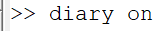{ #fig:001 width=70% }

2. Поскольку оператор diary является переключателем, то достаточно ввести

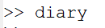{ #fig:001 width=70% }

3. Octave можно использовать как простейший калькулятор. Вычислим выражение

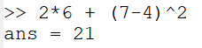{ #fig:001 width=70% }

4. Зададим вектор-строку (ковектор):

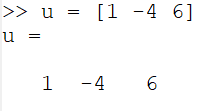{ #fig:001 width=70% }

5. Аналогично можно задать вектор-столбец (вектор):

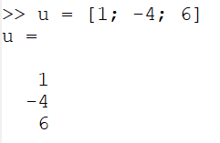{ #fig:001 width=70% }

6. Теперь зададим матрицу:

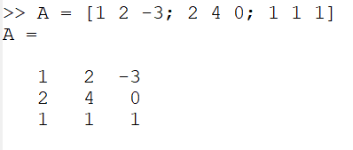{ #fig:001 width=70% }

# 3.4.2. Операции с векторами

1. Зададим два вектора-столбца:

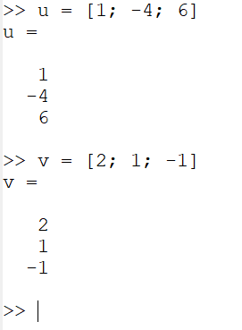{ #fig:001 width=70% }

2. Сложение векторов:

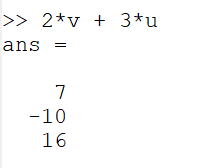{ #fig:001 width=70% }

3. Скалярное умножение векторов:

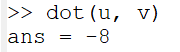{ #fig:001 width=70% }

4. Векторное умножение векторов:

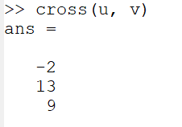{ #fig:001 width=70% }

5. Норма вектора:

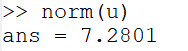{ #fig:001 width=70% }

# 3.4.3. Вычисление проектора

1. Введём два вектора-строки:

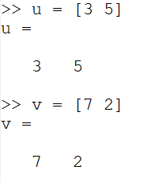{ #fig:001 width=70% }

2. Вычислим проекцию вектора 𝑢⃗ на вектор 𝑣.⃗

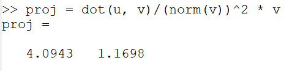{ #fig:001 width=70% }

# 3.4.4. Матричные операции

1. Введём матрицы ̂ A и ̂B:

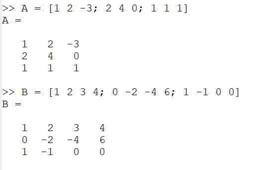{ #fig:001 width=70% }

2. Вычислим произведение матриц ̂ A ̂B:

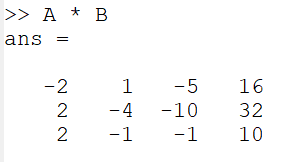{ #fig:001 width=70% }

3. Вычислим произведение матриц1 ̂BTÂ :

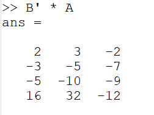{ #fig:001 width=70% }

4. Вычислим 2Â − 4I

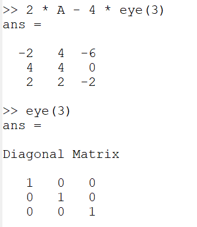{ #fig:001 width=70% }

5. Найдём определитель |Â|:

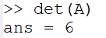{ #fig:001 width=70% }

6. Найдём обратную матрицу Â−1:

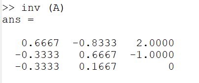{ #fig:001 width=70% }

7. Найдём собственные значения1 матрицы Â :

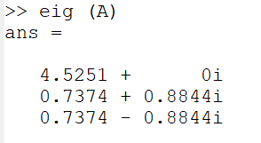{ #fig:001 width=70% }

8. Найдём ранг матрицы Â :

{ #fig:001 width=70% }

# 3.4.5. Построение простейших графиков

Построим график функции sin 𝑥 на интервале [0, 2π].

1. Создадим вектор значений 𝑥:

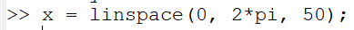{ #fig:001 width=70% }

2. Зададим вектор 𝑦 = sin 𝑥:

{ #fig:001 width=70% }

3. Построим график:

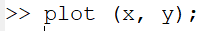{ #fig:001 width=70% }
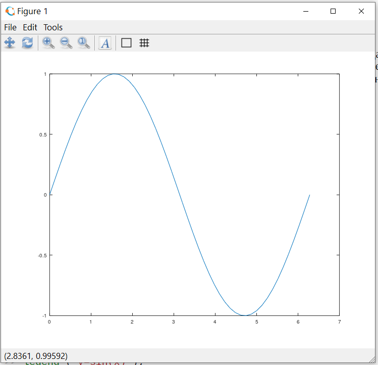{ #fig:001 width=70% }

4. Улучшим внешний вид графика. Сначала очистим получившийся график:

{ #fig:001 width=70% }
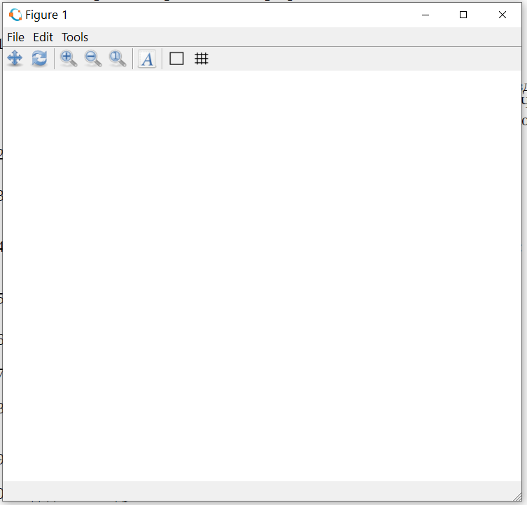{ #fig:001 width=70% }

5. Зададим красный цвет для линии и сделаем её потолще:

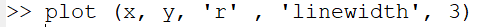{ #fig:001 width=70% }
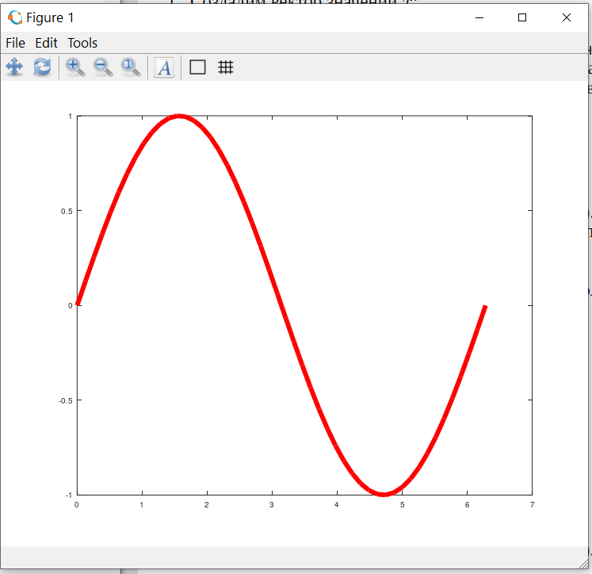{ #fig:001 width=70% }

6. Подгоним диапазон осей:

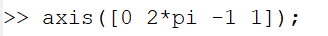{ #fig:001 width=70% }

7. Нарисуем сетку:

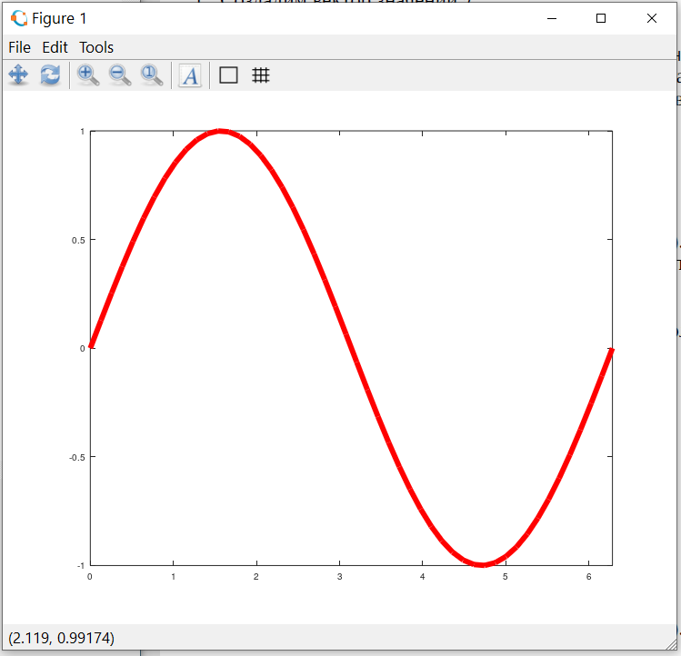{ #fig:001 width=70% }
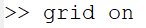{ #fig:001 width=70% }
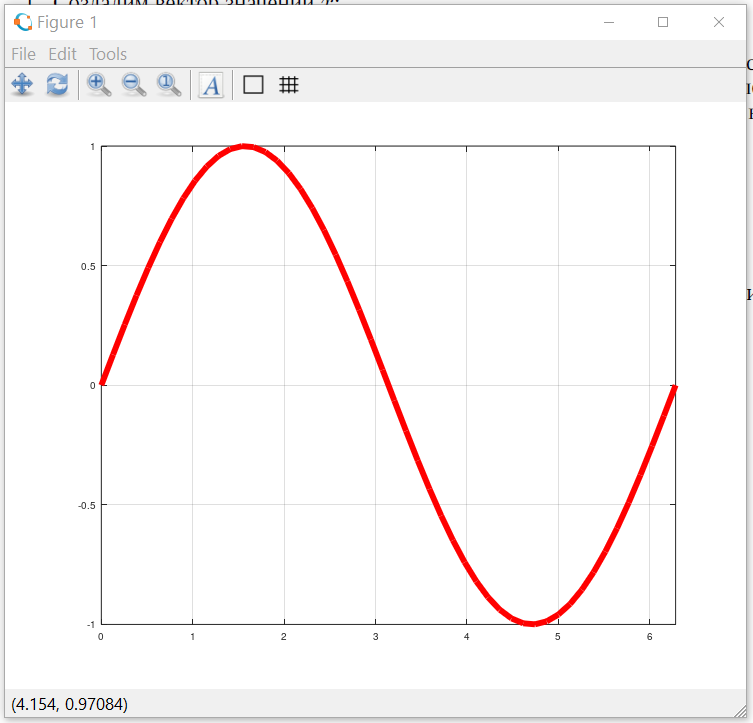{ #fig:001 width=70% }

8. Подпишем оси:

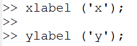{ #fig:001 width=70% }
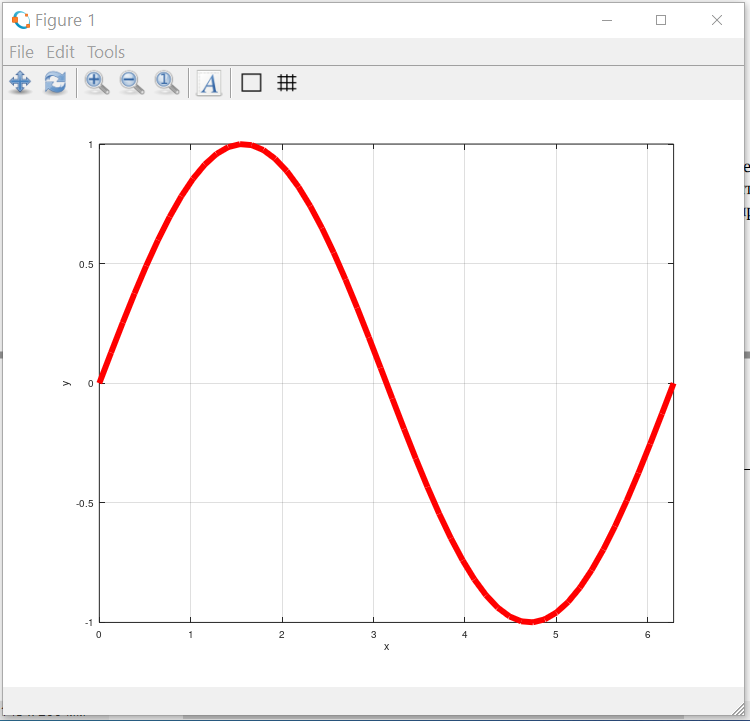{ #fig:001 width=70% }

9. Сделаем заголовок графика:

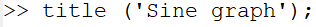{ #fig:001 width=70% }
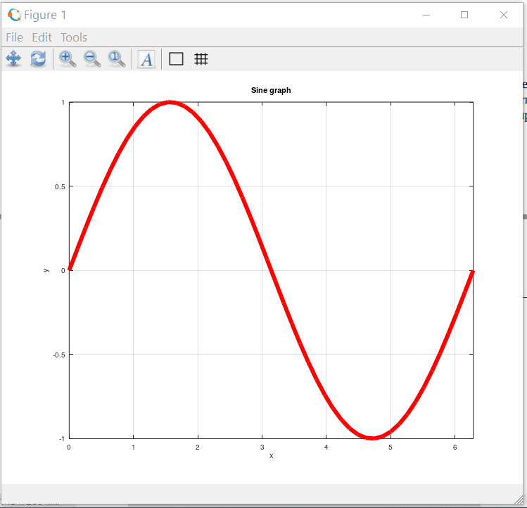{ #fig:001 width=70% }

10. Зададим легенду:

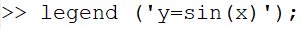{ #fig:001 width=70% }
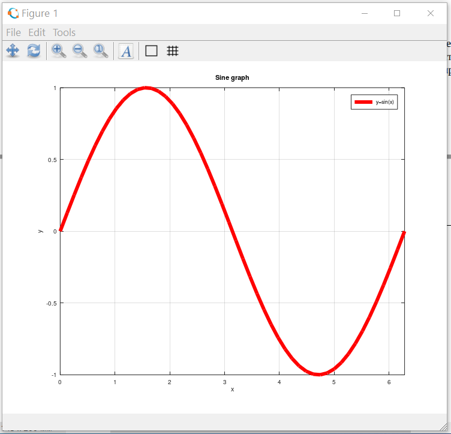{ #fig:001 width=70% }

# 3.4.6. Два графика на одном чертеже

Начертим два графика на одном чертеже.

1. Очистим память и рабочую область фигуры:

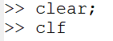{ #fig:001 width=70% }
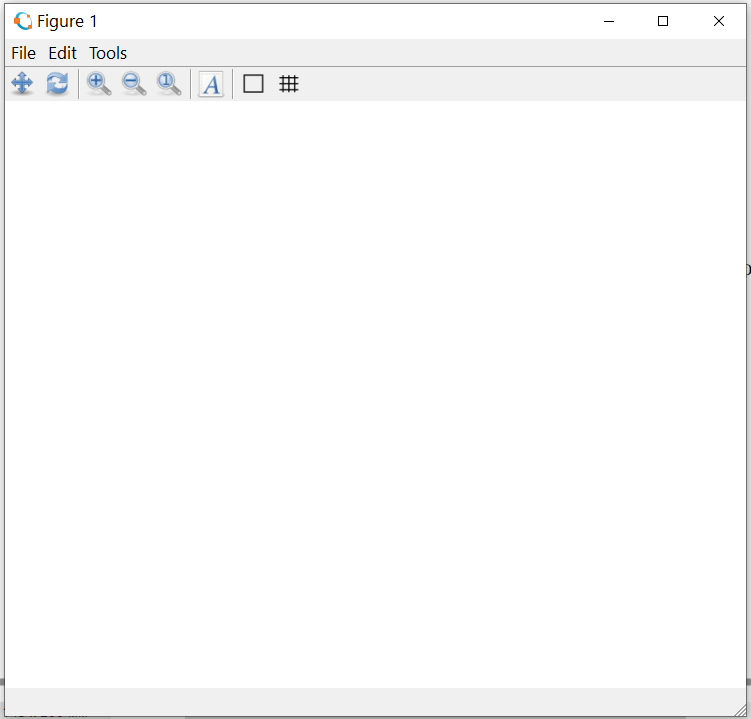{ #fig:001 width=70% }

2. Зададим два вектора:

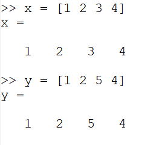{ #fig:001 width=70% }

3. Начертим эти точки, используя кружочки как маркеры:

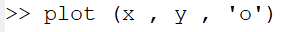{ #fig:001 width=70% }
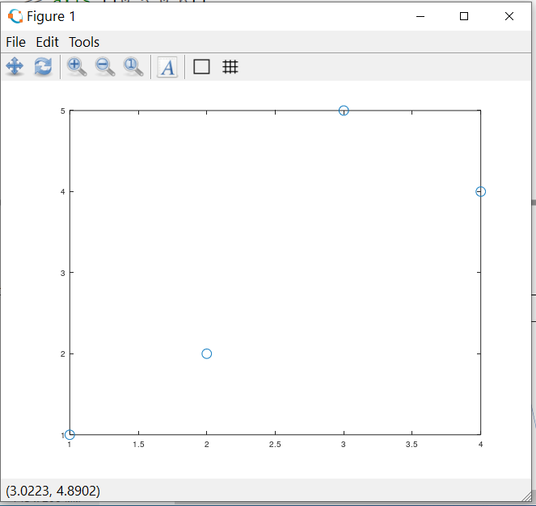{ #fig:001 width=70% }

4. Чтобы добавить к нашему текущему графику ещё один, нужно использовать команду:

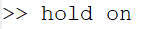{ #fig:001 width=70% }

5. Добавим график регрессии:

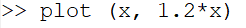{ #fig:001 width=70% }
{ #fig:001 width=70% }

6. Зададим сетку, оси и легенду:

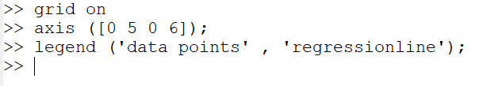{ #fig:001 width=70% }
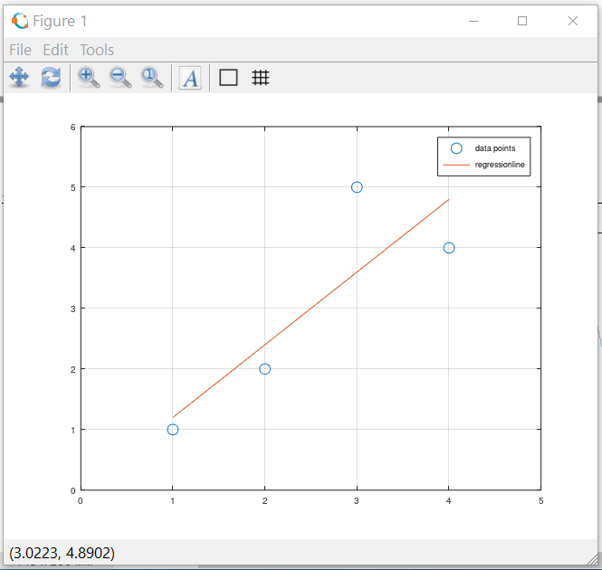{ #fig:001 width=70% }

# 3.4.7. График *y = x^2sinx*

Построим график y = x^2sinx

1. Очистим память и рабочую область фигуры:

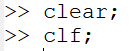{ #fig:001 width=70% }
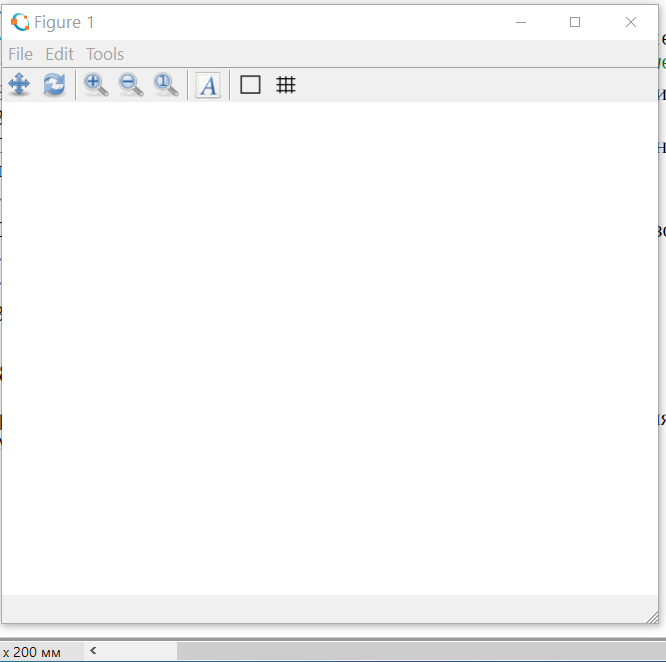{ #fig:001 width=70% }

2. Зададим вектор 𝑥:

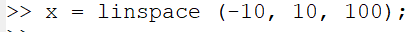{ #fig:001 width=70% }

3. Построим график 𝑦 = 𝑥2 sin 𝑥:

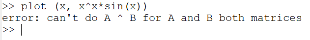{ #fig:001 width=70% }

4. Построим график 𝑦 = 𝑥2 sin 𝑥, используя поэлементное возведение в степень .^ и поэлементное умножение .*:

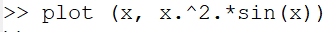{ #fig:001 width=70% }
{ #fig:001 width=70% }

5. Сохраним графики в виде файлов (отметьте два разных формата вызова функции):

Сохранил.

# 3.4.8. Сравнение циклов и операций с векторами

Сравним эффективность работы с циклами и операций с векторами. Для этого вычислим сумму:

1. Очистим память и рабочую область фигуры:

{ #fig:001 width=70% }

2. Вычислим сумму (3.1) с помощью цикла. Создадим файл loop_for.m:

{ #fig:001 width=70% }

3. Вычислим сумму (3.1) с помощью операций с векторами. Создадим файл loop_vec.m:

{ #fig:001 width=70% }

4. Завершим запись в файл:

{ #fig:001 width=70% }

### 3.5. Вывод:

Я научился работать с простейшей операциям в octave.
